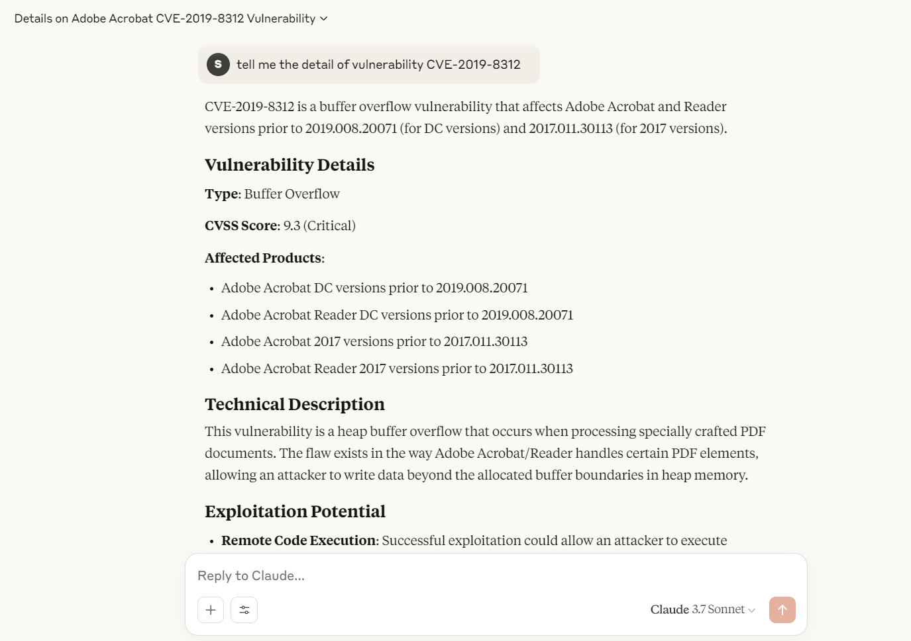
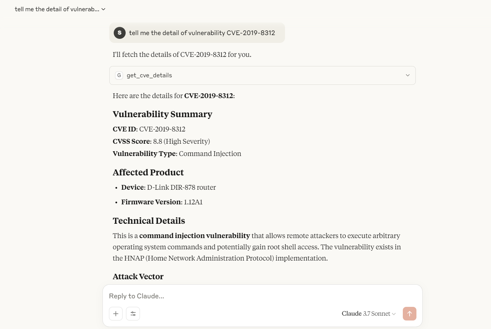

# NVD CVE 查询工具

(一次简陋的MCP尝试)
本项目是一个基于 FastMCP 框架的 CVE（Common Vulnerabilities and Exposures）信息查询工具，支持通过 NVD（美国国家漏洞数据库）API 查询指定 CVE 编号的详细信息。

## 功能简介

- 查询指定 CVE 编号的详细信息，包括描述、CVSS 分数、参考链接等。

## 依赖环境

- Python 3.10+
- [httpx](https://www.python-httpx.org/)
- [mcp](https://github.com/modelcontextprotocol/python-sdk)

## 安装依赖

```shell
# Create and activate a virtual environment
uv venv
.venv\Scripts\activate

# Install dependencies
uv add mcp[cli] httpx
```

## 使用方法

以Claude Desktop为例：
打开`$env:AppData\Claude\claude_desktop_config.json`，添加以下内容：

```json
{
    "mcpServers": {
        "nvd": {
            "command": "uv",
            "args": [
                "--directory",
                "C:\\ABSOLUTE\\PATH\\TO\\PARENT\\FOLDER\\nvd",
                "run",
                "ncd.py"
            ]
        }
    }
}
```
保存文件，并重启Claude Desktop。

## 示例
Without MCP -- False Result


With MCP -- Correct Result


## 参考

- [NVD API 文档](https://nvd.nist.gov/developers/vulnerabilities)
- [Common Vulnerabilities and Exposures (CVE)](https://cve.mitre.org/)

